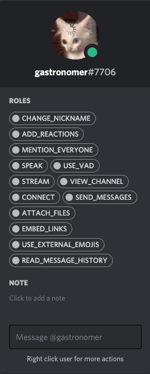

<!DOCTYPE html>
<html lang="en">
  <head>
    <title>Smethbot Documentation</title>
    <meta charset="UTF-8" />
    <link rel="stylesheet" href="styles.css" />
  </head>
  <!-- comment syntax -->

  <!--  <body>
        
CSS lets us style HTML elements. There’s also
            <a href='dummy.html'>another page</a> associated with this example.

    </body> -->

  <body>
    

      
    

    <!-- <button onclick="buttonz()" id="1">button</button> -->

    <h1>Role Permission Management</h1>
    

      Smethbot automatically reorganizes permissions in a way that allows for an
      individual user's permissions to be added or removed without modifying the
      permissions on a role used by a greater number of people. This allows for
      much more granular moderation of a user's permissions in the server. But
      more importantly, it allows a bot to have commands like Smethbot's !naruto
      command, which temporarily changes a user's nickname to a random naruto
      character, and removes their permission to change it back for the
      durration. This type of fun discord interaction is not possible with the
      vanilla way permissions are organized.   
      This is done by <strong>adding a role for every permission</strong> to the
      server, and assinging all users to roles based on what permissions they
      already have. They will still have all the same permissions, but they will
      simply be organized differently. Then the bot saves the permissions of
      your previous roles in a database as templates that can be used to restore
      the server to how it was before anything was changed.
    

    <!--  -->
    <ul>
      <li>
        <a
          class="ExampleImages"
          href="Images/Permission_Example.png"
          target="_blank"
        >
          Here is an example of what permissions may look like for an average
          user.</a
        >
      </li>
    </ul>
    

     

    <h1>!restore</h1>
    

      This
      <strong
        >restores the roles and permissions in the server to their unaltered
        state</strong
      >, and stops the bot from automatically reorganizing roles until you tell
      the bot otherwise. This allows you to change the permissions of general
      roles again without needing to change users' permissions individually.
    

    <ul>
      <li>!restore</li>
    </ul>
    

     

    <h1>@Smethbot !help</h1>
    

      It links you to this page. You have to mention smethbot for this command,
      so that it will not interfere with other bots that may be in the server.
    

    <ul>
      <li>@Smethbot !help</li>
    </ul>
    

     

    <h1>!anon</h1>
    

      DM'ing this to SmethBot (followed by a message), allows you to
      <strong>send this message anonymously</strong> to any channel in any guild
      you have in common with SmethBot. Unless you specify a guild ID
      (optional), SmethBot will give you a selection of available options to
      send the message to.
    

    <ul>
      <li>!anon This is a message i intend to send anonymously</li>
      <li>
        !anon !237830263986585601 This is a message i intend to send to a
        specific guild's main channel (by following !anon with !(GUILD-ID)).
      </li>
    </ul>
    

     

    <h1>!naruto</h1>
    

      This will change your nickname to a random Naruto character in the current
      discord server. You won't be able to change your name back for 2 hours, so
      you have to live with the character you get. SmethBot will message you a
      unique password and the time you will be allowed to use it, which will
      return everything to normal. Some people find that they never want to go
      back. Believe it! Life as a ninja is exciting.
    

    <ul>
      <li>!naruto</li>
      <li>!_123456 (password example)</li>
    </ul>
    

     

    <h1>f</h1>
    

      <strong>f</strong>
    

    <ul>
      <li>
        <strong>f</strong>
      </li>
    </ul>
    

     

    <h1>!botcolor</h1>
    

      This will change SmethBot's name to a random color in the server.
    

    <ul>
      <li>!botcolor</li>
    </ul>
    

     

    <h1>!avatar</h1>
    

      SmethBot will post a larger version of the
      <strong>mentioned user's profile picture</strong>>. if you don't mention
      anyone, it will post your avatar instead. Get a better look.
    

    <ul>
      <li>!avatar @SomeIdiot</li>
      <li>!avatar</li>
    </ul>
    

     

    <h1>!kick</h1>
    

      This will <strong>kick the mentioned user</strong> out of the discord
      channel, but that's a mean thing to do, you cunt.
    

    <ul>
      <li>!kick @SomeIdiot</li>
    </ul>
    

     

  </body>

  
</html>
